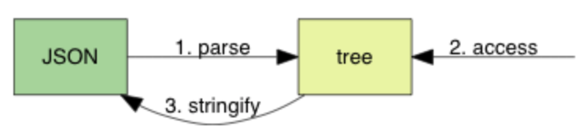

# leptjson.h头文件

## JSON结构

JSON为树状结构，包含六种数据类型

* null: 表示为 null
* boolean: 表示为 true 或 false
* number: 一般的浮点数表示方式，在下一单元详细说明
* string: 表示为 "..."
* array: 表示为 [ ... ]
* object: 表示为 { ... }

如下例子所示：

```C++
{
    "title": "Design Patterns",
    "subtitle": "Elements of Reusable Object-Oriented Software",
    "author": [
        "Erich Gamma",
        "Richard Helm",
        "Ralph Johnson",
        "John Vlissides"
    ],
    "year": 2009,
    "weight": 1.8,
    "hardcover": true,
    "publisher": {
        "Company": "Pearson Education",
        "Country": "India"
    },
    "website": null
}
```

主要需求：

1. 把 JSON 文本解析为一个树状数据结构（parse）。
2. 提供接口访问该数据结构（access）。
3. 把数据结构转换成 JSON 文本（stringify）。



chapter1主要进行bool和null的解析

### 语法子集

chapter1的json语法使用 [RFC7159](https://tools.ietf.org/html/rfc7159) 中的 [ABNF](https://tools.ietf.org/html/rfc5234) 表示:

```C
JSON-text = ws value ws
ws = *(%x20 / %x09 / %x0A / %x0D)
value = null / false / true 
null  = "null"
false = "false"
true  = "true"
```

其中，`%x`表示16进制，`/`表示多选一，`*`表示零个或多个，`()`表示整体。这里的数字对应相应的ascii码，表示空格、制表符、换行符、回车符。

## include 防范

一个头文件在同一个文件下只能被包含一次，但由于头文件也能包含其他头文件，就可能出现某个文件包含了一个头文件多次的情况，使用include防范避免此问题。

```C++
#ifndef _LEPTJSON_H_
#define _LEPTJSON_H_
/*头文件内容*/
#endif
```

leptjson.h文件的开头结尾如上所示：`ifndef`为预编译指令，`_LEPTJSON_H_`可以为任意的的名字，这里使用_开头是考虑到该名称在其他地方不太可能被定义，`_H_`结尾则为一种习惯，若有多个头文件，则可以使用`项目名称_目录_文件名称_H_`的形式。

编译器第一次遇到该文件时，此时`_LEPTJSON_H_`还未被定义，执行内容，定义`_LEPTJSON_H_`。之后若再include该头文件时，因为此时`_LEPTJSON_H_`已被定义，不满足line1的内容，故line1后的内容不再执行。即<font color = "red">它忽略第一次include以外的所有内容，而不是防止编译器将文件include两次</font>。

[参考](https://blog.csdn.net/Bubbler_726/article/details/104618748)

## C 枚举类型

C有一种称为`enum`的枚举型数据类型，其写法与结构体类似，不同的是内部直接写枚举值，如：

```C
enum typeName{ valueName1, valueName2, valueName3, ...... };
```

可以看成一个集合，内部的枚举值均为一些命名的<font color = "red">整型变量（包括char类型）</font>，从0开始，递增+1，也可以给第n个整型变量赋初值n，之后的枚举值在n的基础上递增+1，但不改变第n个前面的枚举值。即显式说明了枚举常量的值时，未指定的枚举名的值将依着最后一个指定值向后依次递增（注意是最后一个指定值）。`typeName`为集合的名字，类型的定义以`;`结束。

使用`typeNmae`定义枚举变量，<font color = "red">枚举变量只能被赋予枚举值</font>，否则需要进行类型转换。

[参考](https://www.cnblogs.com/lanhaicode/p/10620028.html)

---

```C
typedef enum { LEPT_NULL, LEPT_FALSE, LEPT_TRUE, LEPT_NUMBER, LEPT_STRING, LEPT_ARRAY, LEPT_OBJECT } lept_type;
```

由前文知，JSON主要有六种变量类型，若false/true算为两种，则有七种类型，使用枚举得到以上的集合类型`lept_type`。

目前，只需实现NULL/TRUE/FALSE类型的解析，我们定义一个用来存放JSON值的结构体`lept_value`,之后会逐步完善该结构体。

```C
typedef struct{
	lept_type type;
} lept_value;
```

之后声明两个函数，一个为解析函数，一个为获取某个json值类型的函数，即获取解析结果的函数

解析函数：

```C
int lept_prase(lept_value* v, const char *json);
```

解析函数的参数为一个负责存储解析结果的v和解析前的字符串json；由于我们不希望改变json的内容，故使用const实现；该函数的返回值为错误类型，如下所示；

获取解析结果：

```C
lept_type lept_get_type(const lept_value* v);
```

解析函数的返回值类型如下：

```C
enum {
	LEPT_PARSE_OK = 0,
	LEPT_PARSE_EXPECT_VALUE,
	LEPT_PARSE_INVALID_VALUE,
	LEPT_PARSE_ROOT_NOT_SINGULAR
};
```

结合json语法，各个类型分别表示：

* 返回值解析无错误
* 返回值解析缺少内容
* 返回解析出现了除7种类型以及ws以外的无效类型
* 返回值在解析完`ws value ws`后还有其他内容

# test.c 文件

## 测试驱动开发（test-driven development, TDD）

1. 加入一个测试。
2. 运行所有测试，新的测试应该会失败。
3. 编写实现代码。
4. 运行所有测试，若有测试失败回到3。
5. 重构代码。
6. 回到 1

## 宏定义相关

* `/`表示一行未结束

* 输出函数里面，多个`""`一起写的时候之间可以没有逗号。

* 输出中`%3.2f`3表示输出至少三个字符，不足的补空格

* 分号吞噬问题：[ref](https://blog.csdn.net/imgosty/article/details/81901183)

  test.c中使用`do{}while(0)`的结构旨在防止宏定义的分号吞噬问题。若宏定义里面有多过一个语句，则需要使用该方法，以下例子来自origin

  ```C
  #define M() a(); b()
  if (cond)
      M();
  else
      c();
  
  /* 预处理后 */
  
  if (cond)
      a(); b(); /* b(); 在 if 之外     */
  else          /* <- else 缺乏对应 if */
      c();
  ```

  只使用`{}`也不行

  ```C
  #define M() { a(); b(); }
  
  /* 预处理后 */
  
  if (cond)
      { a(); b(); }; /* 最后的分号代表 if 语句结束 */
  else               /* else 缺乏对应 if */
      c();
  ```

  使用`do{}while(0)`即可解决

  ```C
  #define M() do { a(); b(); } while(0)
  
  /* 预处理后 */
  
  if (cond)
      do { a(); b(); } while(0);
  else
      c();
  ```

* stdout和stderr的区别：

  * stdout为标准输出，在`fprintf`中使用`stdout`的话其效果与`printf`相同，输出为行缓冲，只有换行时才会输出；而`stderr`为标准错误，其输出无缓冲，会直接输出。
  * [参考](https://blog.csdn.net/c_phoenix/article/details/52858151)

* \__FILE__   \_\_LINE__

  `__FILE__`用于指示本行语句所在源文件的文件名，`__LINE__`用于指示本行语句在源文件中的行号，可使用`__LINE__`修改其值，[ref](https://blog.csdn.net/qingzhuyuxian/article/details/80968135)

* 更多参考

  * [C语言中宏定义的使用](https://blog.csdn.net/imgosty/article/details/81901183)
  * [C语言中宏定义#、##、#@、\\的用法](https://blog.csdn.net/l101606022/article/details/79021401)


# leptjson.c

## 断言

断言assert，简单说就是测试内部的bool语句的真值，若为真，则正常执行；否则，终止程序，并输出相应的错误信息。在debug模式下可用，在release中不可用。也可以在程序开头添加`#define NDEBUG`,这样编译器就会禁用文件中的所有assert语句。

```
assert()宏接受一个整型表达式作为参数。如果表达式求值为假，assert()宏就在标准错误流（stderr） 中写入一条错误信息， 并调用abort()函数终止程序。
```

## json实例

```json
{
    "title": "Design Patterns",
    "subtitle": "Elements of Reusable Object-Oriented Software",
    "author": [
        "Erich Gamma",
        "Richard Helm",
        "Ralph Johnson",
        "John Vlissides"
    ],
    "year": 2009,
    "weight": 1.8,
    "hardcover": true,
    "publisher": {
        "Company": "Pearson Education",
        "Country": "India"
    },
    "website": null
}
```

判断规则：

- n ➔ null
- t ➔ true
- f ➔ false
- " ➔ string
- 0-9/- ➔ number
- [ ➔ array
- { ➔ object


