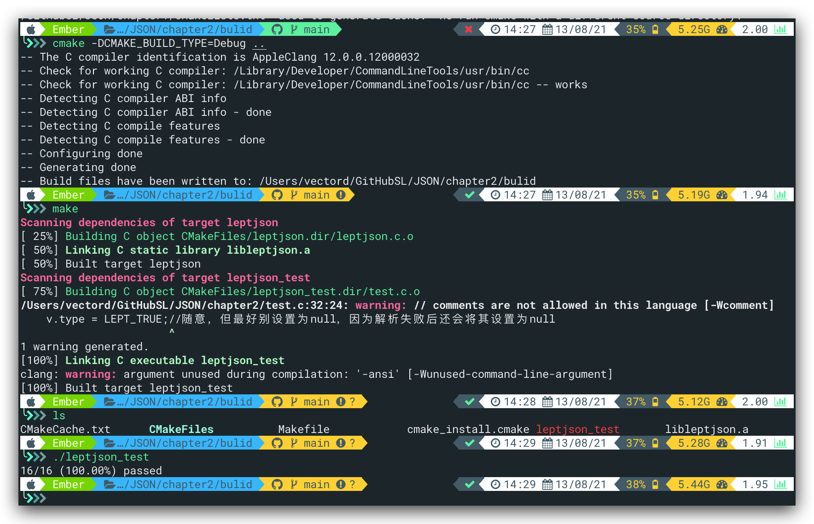
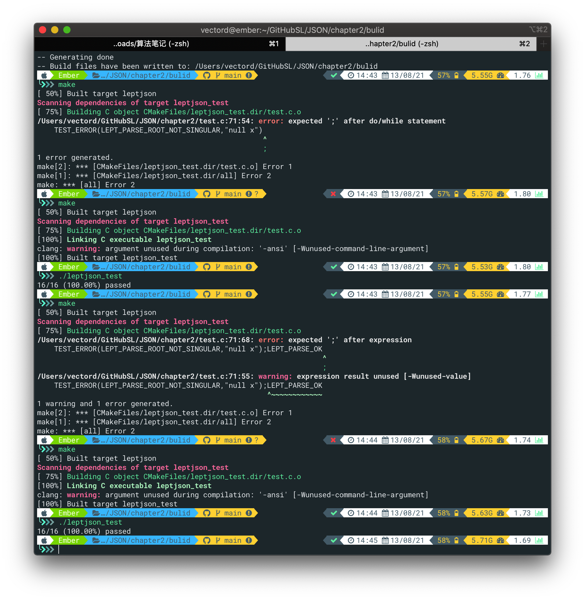
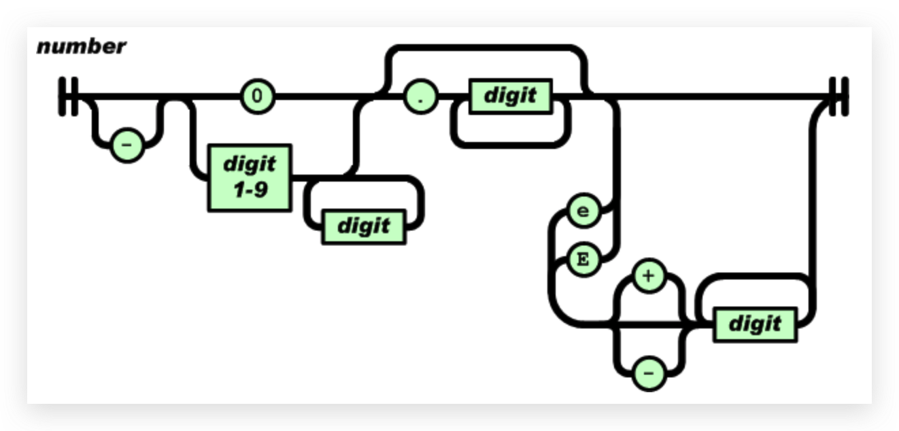
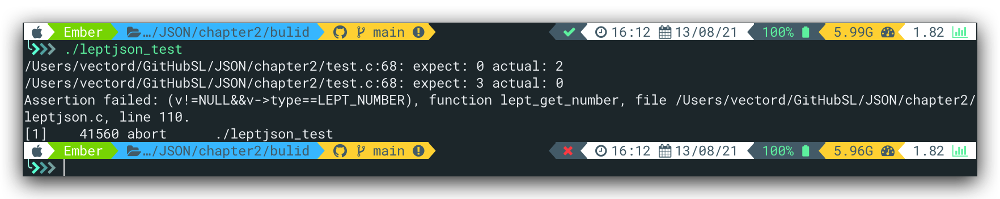
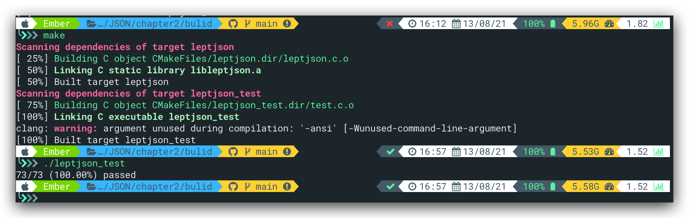
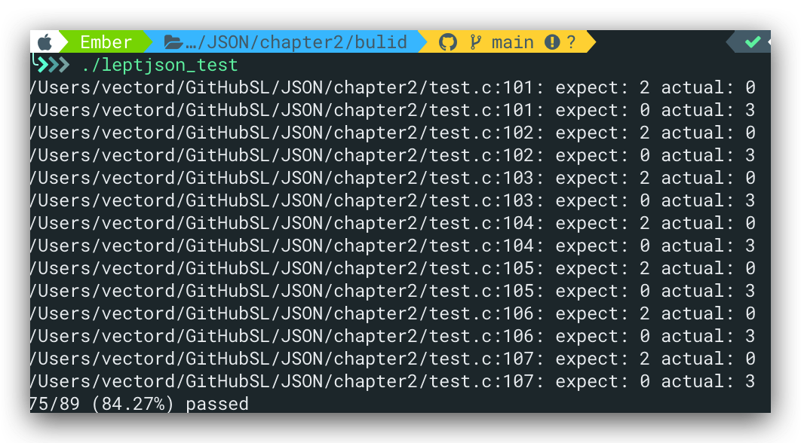

# 重构

之前大三写OO的时候也经常重构代码，就是在**不改变代码外在行为的情况下改善程序的内部结构。**在test.c	程序中，`test_parse_true`,`test_parse_null`,`test_parse_false`这几个程序包含了很多重复代码，这违反了DRY(do not repeat yourself)原则。故需要对这三个函数进行重构。

此外，在函数`test_parse_expect_value`,`test_parse_invalid_value`中，每测试一个JSON值，都会有两行代码的重复，为此，引入如下的宏定义：

```C
#define TEST_ERROR(error, json)\
    do {\
        lept_value v;\
        v.type = LEPT_TRUE;\
        EXPECT_EQ_INT(error, lept_parse(&v, json));\
        EXPECT_EQ_INT(LEPT_NULL, lept_get_type(&v));\
    }while(0)
```

引入该宏定义后，以`test_parse_invalid_value`为例，其函数结构如下所示：

```C
static void test_parse_invalid_value(){
    TEST_ERROR(LEPT_PARSE_INVALID_VALUE,"nul");
    TEST_ERROR(LEPT_PARSE_INVALID_VALUE,"invalid");
}
```

这样子的重构的使得代码结构更容易维护，但性能方面出现了些许损失。

将test文件中的所有测试**ERROR**代码都进行了如上重构，**重新cmake**后测试通过。



<font color = "red">注意！！！</font>修改文件的时候在chapter2里修改，我说呢，每次cmake后结果都一样。。。



# 数字

为简单起见，leptjson使用双精度double存储JSON数字。先来看一下JSON数字的语法：

```json
number = [ "-" ] int [ frac ] [ exp ]
int = "0" / digit1-9 *digit
frac = "." 1*digit
exp = ("e" / "E") ["-" / "+"] 1*digit
```

JSON数字由符号、整数、小数以及指数组成。其中只有整数部分为必需。注意符号只可为`-`，不可为`+`，即以`+`开头的数字为格式错误。整数部分若以0开始，则只能为单个数字0；否则，为由`1-9`组成的若干数字。

小数部分比较直观，就是小数点后是一或多个数字（0-9)

JSON 可使用科学记数法，指数部分由大写 E 或小写 e 开始，然后可有正负号，之后是一或多个数字（0-9）



---

为存储数字，在`lept_value`中添加成员:`double n`。同时添加函数`lept_get_number`来获取json的number值。注意，只有lept_type==LEPT_NUMBER时才会存储number，故使用assert断言。

```c
lept_type lept_get_number(const lept_value* v){
	assert(v!=NULL&&v->type==LEPT_NUMBER);
	return v->n;
}
```

---

<font color = "red">宏定义的参数是**无类型的**</font>[参考](https://www.cnblogs.com/mini-coconut/p/8516801.html)

---

# 测试

首次写测试时，没考虑到格式的问题，在`TEST_NUMBER`里使用的format均是%d，更改后新增的测试如下：

```C++
#define (expect, actual) EXPECT_EQ_BASE((expect) == (actual), expect, actual, "%.17g")

/* test json_number*/
#define TEST_NUMBER(expect, json)\
    do{\
        lept_value v;\
        v.type = LEPT_FALSE;\
        EXPECT_EQ_INT(LEPT_PARSE_OK, lept_parse(&v, json));\
        EXPECT_EQ_INT(LEPT_NUMBER, lept_get_type(&v));\
        EXPECT_EQ_DOUBLE(expect, lept_get_number(&v));\
    }while(0)

static void test_parse_number(){
    TEST_NUMBER(0.0, "0");
    TEST_NUMBER(0.0, "-0");
    TEST_NUMBER(0.0, "-0.0");
    TEST_NUMBER(1.0, "1");
    TEST_NUMBER(-1.0, "-1");
    TEST_NUMBER(1.5, "1.5");
    TEST_NUMBER(-1.5, "-1.5");
    TEST_NUMBER(3.1416, "3.1416");
    TEST_NUMBER(1E10, "1E10");
    TEST_NUMBER(1e10, "1e10");
    TEST_NUMBER(1E+10, "1E+10");
    TEST_NUMBER(1E-10, "1E-10");
    TEST_NUMBER(-1E10, "-1E10");
    TEST_NUMBER(-1e10, "-1e10");
    TEST_NUMBER(-1E+10, "-1E+10");
    TEST_NUMBER(-1E-10, "-1E-10");
    TEST_NUMBER(1.234E+10, "1.234E+10");
    TEST_NUMBER(1.234E-10, "1.234E-10");
    TEST_NUMBER(0.0, "1e-10000"); /* must underflow */
}
```

首次写完测试后make时一直报格式的错误，几经周折，发现有两个地方自己在写的时候忽视了：

1. 如上所述需要增加`EXPECT_EQ_DOUBLE`的宏
2. `lept_get_number`的返回类型应该为<font color = "red">double</font>

之后make便无报错。

%g：用来输出实数，它根据数值的大小，自动选f格式或e格式（选择输出时占宽度较小的一种），且不输出无意义的0。即%g是根据结果自动选择科学记数法还是一般的小数记数法。17是因为double的长度为17位有效数字[参考](https://blog.csdn.net/chenlu1/article/details/49443531)

此外，在`test_parse_invalid_value`里加入如下代码来测试不合法的数字用例

```C++
		/*test invalid number*/
    TEST_ERROR(LEPT_PARSE_INVALID_VALUE,"+0");
    TEST_ERROR(LEPT_PARSE_INVALID_VALUE, "+1");
    TEST_ERROR(LEPT_PARSE_INVALID_VALUE, ".123"); /* at least one digit before '.' */
    TEST_ERROR(LEPT_PARSE_INVALID_VALUE, "1.");   /* at least one digit after '.' */
    TEST_ERROR(LEPT_PARSE_INVALID_VALUE, "INF");
    TEST_ERROR(LEPT_PARSE_INVALID_VALUE, "inf");
    TEST_ERROR(LEPT_PARSE_INVALID_VALUE, "NAN");
    TEST_ERROR(LEPT_PARSE_INVALID_VALUE, "nan");
```

make以后无error，当然，此时运行test.c无法通过测试。由错误信息可见错误为刚编写的测试函数，这里我们简单分析一下错误信息：



该信息表示测试失败的代码位于68行

```C++
TEST_NUMBER(0.0, "0");
```

这里出现了三个错误，

1. 第一个报错`expect: 0 actual: 2`由`TEST_NUMBER`宏给出`EXPECT_EQ_INT(LEPT_PARSE_OK, lept_parse(&v, json))`,期望值为`LEPT_PARSE_OK`，实际上因为没写相关的number解析函数，故解析失败，返回的为`LEPT_PARSE_INVALID_VALUE`，即枚举值2；
2. 第二个报错`expect: 3 actual: 0`同样由`TEST_NUMBER`宏给出`EXPECT_EQ_INT(LEPT_NUMBER, lept_get_type(&v))`，期望值为`LEPT_NUMBER`,即枚举值3。实际值由于上一步解析失败被赋予了`LEPT_NULL`，即枚举值0；
3. 第三个报错为get number时的assert断言

# parse_number

使用标准库的`strtod()`函数将字符串转换为double类型，其中`strtod()`的第二个参数为首个无法被解析的字符的地址。故下面的代码line5表示json串无法被解析。

```C
static int lept_parse_number(lept_context* c, lept_value* v){
	char *end;
	v->n = strtod(c->json, &end);
	/*end 为第一个不能转换的字符的指针*/
	if(c->json==end)
		return LEPT_PARSE_INVALID_VALUE;
	c->json = end;
	v->type = LEPT_NUMBER;
	return LEPT_PARSE_OK;
}
```

在`lept_parse_value`内部，除了`null`,`true`,`false`以外均为number类型，故使用`default`

```C
static int lept_parse_value(lept_context* c,lept_value* v){
	switch(*c->json){
		case 'n' : return lept_parse_null(c,v);
		case 't' : return lept_parse_true(c,v);
		case 'f' : return lept_parse_false(c,v);
		case '\0': /*printf("LEPT_PARSE_EXPECT_VALUE\n");*/return LEPT_PARSE_EXPECT_VALUE;
		default:   /*printf("LEPT_PARSE_INVALID_VALUE\n");*/return lept_parse_number(c,v);
	}
}
```

# 结尾

根据origin在`test.c`中添加`#if 0 #endif`相关代码用于作业。执行make并运行后测试通过。



`#if 0 #endif`：与`/* */`相比，前者支持嵌套，而且可以将0改为1来恢复代码，更多关于条件编译[详见](http://m.biancheng.net/view/449.html)

按照作业要求，增加了`#if 0 #endif`相关代码，并将0改为1后，测试自然无法通过。



# HomeWork

## task 1

重构`lept_parse_null()`、`lept_parse_false()`、`lept_parse_true` 为 `lept_parse_literal()`时，刚开始的`lept_parse_literal()`是这样写的：

```C
static int lept_parse_literal(lept_context* c, lept_value* v, const char* literal, lept_type type){
	int i;
	EXPECT(c, literal[0]);
	for(i=0;literal[i];i++){
		if(c->json[i]!=literal[i+1])
			return LEPT_PARSE_INVALID_VALUE;
	}
	c->json+=i;
	v->type = type;
	return LEPT_PARSE_OK;
}
```

注意line4的`literal[i]`，这里其实也没有错，主要错误在于line8会多+1，致使`\0`被忽略，导致`lept_parse`函数内部`if(*c.json!='\0')ret = LEPT_PARSE_ROOT_NOT_SINGULAR;`报错。具体可见`leptjson.c`的printf调试

## task3

* 常量指针：

  `type const* name`:指针指向的内容为常量时，该内容不能被修改，但指针指向的地址可以修改。即指向可变，指向的内容不可变。<font color = "red">注意，常量指针可以被赋予变量的地址</font>，此时不能通过该指针来改变变量的值，但可以通过原来的变量或其他指针修改变量的值。例如：

  ```C
  int a=5;
  const int* n=&a;
  a=6;
  ```

  核心：<font color = "red">不能通过该指针修改指向的地址的值</font>

* 指针常量：

  `type *const name`:指针为一个常量，该指针的值，即指向的地址不能被修改。但是地址里的值能被修改，只是指向的地址不能被修改。

* 指向常量的常量指针：

  `* 两边有 const`:指针的指向不能更改，也不能通过该指针改变该变量的值。但能通过变量本身或其他指针改变变量的值。

* [参考1](https://blog.csdn.net/xingjiarong/article/details/47282255)    [参考2](https://blog.csdn.net/xiaocheng198810/article/details/41542473)

---


# To Do

- [ ] lept_parse_value内部default顺序