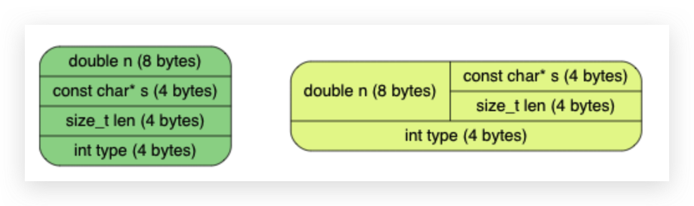
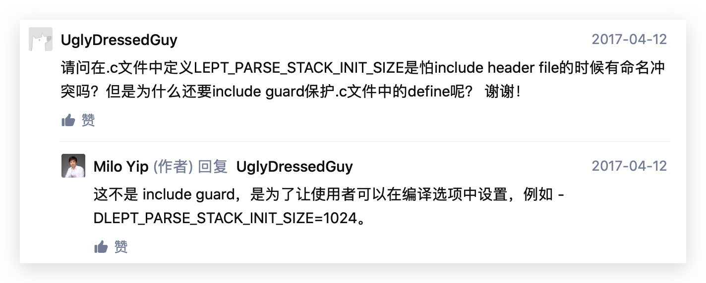

# JSON字符串语法

```
string = quotation-mark *char quotation-mark
char = unescaped /
   escape (
       %x22 /          ; "    quotation mark  U+0022
       %x5C /          ; \    reverse solidus U+005C
       %x2F /          ; /    solidus         U+002F
       %x62 /          ; b    backspace       U+0008
       %x66 /          ; f    form feed       U+000C
       %x6E /          ; n    line feed       U+000A
       %x72 /          ; r    carriage return U+000D
       %x74 /          ; t    tab             U+0009
       %x75 4HEXDIG )  ; uXXXX                U+XXXX
escape = %x5C          ; \
quotation-mark = %x22  ; "
unescaped = %x20-21 / %x23-5B / %x5D-10FFFF
```

escape为转义字符，在`\`后跟相应的字符

# 字符串表示

C中的字符串都表示为空结尾字符串，即以`\0`结尾。然而，JSON字符串是允许带有空字符的，使用纯粹的空结尾字符串无法表示JSON字符串，故使用分配内存来存储字符串。（这个因果关系说实话我没看懂，看看后面的具体实现吧）

具体实现上，我们可以增加`lept_type`内的成员：`char* s; size_t len`

---

`size_t`：简单说就可以将它视为方便移植的`usigned`数据类型，用于表示size的大小

具体可参考：[stackoverflow](https://stackoverflow.com/questions/19732319/difference-between-size-t-and-unsigned-int#:~:text=The%20purpose%20of%20size_t%20is,more%20likely%20to%20be%20portable)  [知乎](https://www.zhihu.com/question/24773728/answer/1904137353) (前一个的总结) [csdn](https://blog.csdn.net/xiagu_jinchengwu/article/details/79401522)

---

我们知道，一个数据类型不可能即为number又为字符串，故使用`union`来简化，节省空间

```C
typedef struct{
	union{
		struct {char* s; size_t len;}s;/*string*/
		double n;                      /*number*/
	}u;
	lept_type type;
} lept_value;
```

改用union后的内存布局如下（32位平台）



使用以上写法后，我们需要将之前的`v->n`改为`v->u.n`。经过实际测试，使用匿名的union可以不用修改代码，即在union定义后不加名字u，这里我们还是跟着教程走使用加u的方式。

---

匿名union位C11的新特性，具体可见[这里](https://blog.csdn.net/weixin_43835637/article/details/103811642)

---

这里由于提到C11，突发奇想，发现同样的代码：

```C
int main() {
    test_parse();
    printf("%d/%d (%3.2f%%) passed\n", test_pass, test_count, test_pass * 100.0 / test_count);
    printf("%s\n",__VERSION__);
    return main_ret;
}
```

在Xcode和cmake环境下输出的编译器版本不一样，具体内容见`QuestionNote.md`8月15号的内容

# 内存管理

字符串的长度不固定，所以需要动态分配内存。使用标准库`<stdlib.h>`中的`malloc()`、`realloc()`以及`free()`类进行内存的分配与释放

---

`realloc()`：realloc(void \*\__ptr, size_t __size)：更改已经配置的内存空间，即更改由malloc()函数分配的内存空间的大小。


如果将分配的内存减少，realloc仅仅是改变索引的信息。

如果是将分配的内存扩大，则有以下情况：

1. 如果当前内存段后面有需要的内存空间，则直接扩展这段内存空间，realloc()将返回原指针。
2. 如果当前内存段后面的空闲字节不够，那么就使用堆中的第一个能够满足这一要求的内存块，将目前的数据复制到新的位置，并将原来的数据块释放掉，返回新的内存块位置。
3. 如果申请失败，将返回NULL，此时，原来的指针仍然有效。

<font color = "red">注意</font>：如果调用成功，不管当前内存段后面的空闲空间是否满足要求，都会释放掉原来的指针，重新返回一个指针，虽然返回的指针有可能和原来的指针一样，即不能再次释放掉原来的指针。

[参考](https://blog.csdn.net/hackerain/article/details/7954006)

---

注意`memcpy`函数需include头文件`string.h`

设立初始化value函数：`#define init(v) do{ (v)->type = LEPT_NULL; }while(0)`

前面的章节只设立了访问函数，没设立写入函数，设立写入函数如下：

```C
#define lept_set_null(v) lept_free(v)

int lept_get_boolean(const lept_value* v);
void lept_set_boolean(lept_value* v, int b);

double lept_get_number(const lept_value* v);
void lept_set_number(lept_value* v, double n);

const char* lept_get_string(const lept_value* v);
size_t lept_get_string_length(const lept_value* v);
void lept_set_string(lept_value* v, const char* s, size_t len);
```

其中，line9修饰函数返回值，能够防止该指针修改地址指向的内容，只能被赋给同类型的const。同时，const修饰函数返回值时，返回值应该使用指针传递的方式。使用值传递的返回值会拷贝，使用const修饰毫无意义。[ref](https://blog.csdn.net/youoran/article/details/8517611)

（才知道C里没有专门的bool类型，惭愧）

在设立了init和free函数，我们修改现有的test代码，以`test_parse_null`为例：

```C
static void test_access_string() {
    lept_value v;
    lept_init(&v);
    lept_set_string(&v, "", 0);
    EXPECT_EQ_STRING("", lept_get_string(&v), lept_get_string_length(&v));
    lept_set_string(&v, "Hello", 5);
    EXPECT_EQ_STRING("Hello", lept_get_string(&v), lept_get_string_length(&v));
    lept_free(&v);
}
```

新加测试：字符串相关`EXPECT_EQ_STRING`

```C
#define EXPECT_EQ_STRING(expect, actual, alength) \
    EXPECT_EQ_BASE(sizeof(expect) - 1 == alength && memcmp(expect, actual, alength) == 0, expect, actual, "%s")
```

之后建立一下测试，测试字符串的set和get过程，注意不是parse过程

```C
static void test_access_string() {
    lept_value v;
    lept_init(&v);
    lept_set_string(&v, "", 0);
    EXPECT_EQ_STRING("", lept_get_string(&v), lept_get_string_length(&v));
    lept_set_string(&v, "Hello", 5);
    EXPECT_EQ_STRING("Hello", lept_get_string(&v), lept_get_string_length(&v));
    lept_free(&v);
}
```

<font color = "red">注意</font>：`sizeof`和`strlen`的区别，前者不会统计结束符，后者会。但返回的均是size_t类型，即<font color = "red">非负</font>。[ref](http://c.biancheng.net/view/342.html)   故以下输出为1

```c
printf("%lu\n",sizeof(""));
```

# 缓冲区与堆栈

我们上面提到过，JSON语法允许接收空串，即允许带有空字符。譬如类似于`"Hello\u0000World"`的字符串JSON也可接收。这就要求我们在解析字符串时，需要先讲解析好的串存到缓冲区，待全部解析完成后，才将缓冲区内的串整个set进v内。由于缓冲区大小无法预知，故使用动态数组的结构，类似C++里的vector

使用栈的结构来模拟动态数组：

```C
typedef struct{
	const char* json;
	char* stack;
	size_t size, top;
}lept_context;
```

放在lept_context里定义是为了重用stack，每次解析JSON就使用一个stack，而不是每次解析字符串时使用stack。

在创建`lept_context`时，需要初始化以上新增的结构以及最后的释放。使用assert确保最后栈内元素均被弹出

```C
int lept_parse(lept_value* v, const char* json) {
    lept_context c;
    int ret;
    assert(v != NULL);
    c.json = json;
    c.stack = NULL;        /* <- */
    c.size = c.top = 0;    /* <- */
    lept_init(v);
    lept_parse_whitespace(&c);
    if ((ret = lept_parse_value(&c, v)) == LEPT_PARSE_OK) {
        /* ... */
    }
    assert(c.top == 0);    /* <- */
    free(c.stack);         /* <- */
    return ret;
}
```

---

压入与弹出操作：

实现要入与弹出的操作，返回数据起始的指针。注意当空间不足时，以1.5倍大小扩展，原因在[这里](https://www.zhihu.com/question/25079705/answer/30030883)。

```C
#ifndef LEPT_PARSE_STACK_INIT_SIZE
#define LEPT_PARSE_STACK_INIT_SIZE 256
#endif

static void* lept_context_push(lept_context* c, size_t size) {
    void* ret;
    assert(size > 0);
    if (c->top + size >= c->size) {
        if (c->size == 0)
            c->size = LEPT_PARSE_STACK_INIT_SIZE;
        while (c->top + size >= c->size)
            c->size += c->size >> 1;  /* c->size * 1.5 */
        c->stack = (char*)realloc(c->stack, c->size);
    }
    ret = c->stack + c->top;
    c->top += size;
    return ret;
}

static void* lept_context_pop(lept_context* c, size_t size) {
    assert(c->top >= size);
    return c->stack + (c->top -= size);
}
```

`#ifndef X #define X ... #endif`：这里这样写其实是为设置一个缺省值256，在终端编译时，可以使用`-D`指令定义宏定义`LEPT_PARSE_STACK_INIT_SIZE`，这样进入该程序时就不会重新定义为256；若没有定义编译选项，则默认为缺省值256。[gcc -D](https://blog.csdn.net/y396397735/article/details/53736416?utm_medium=distribute.pc_relevant_t0.none-task-blog-BlogCommendFromBaidu-1.control&depth_1-utm_source=distribute.pc_relevant_t0.none-task-blog-BlogCommendFromBaidu-1.control)

注意，这里`#else 与 #endif`的区别，别想错了，把后者想成了前者，以为没有定义编译选项后后面的程序就不执行了。 [C语言中#ifndef X #define X ... #endif的用法](https://www.cnblogs.com/mupanxi/p/5043707.html)



# 解析字符串

```C
#define PUTC(c, ch) do { *(char*)lept_context_push(c, sizeof(char)) = (ch); } while(0)

static int lept_parse_string(lept_context* c, lept_value* v) {
    size_t head = c->top, len;
    const char* p;
    EXPECT(c, '\"');
    p = c->json;
    for (;;) {
        char ch = *p++;
        switch (ch) {
            case '\"':
                len = c->top - head;
                lept_set_string(v, (const char*)lept_context_pop(c, len), len);
                c->json = p;
                return LEPT_PARSE_OK;
            case '\0':
                c->top = head;
                return LEPT_PARSE_MISS_QUOTATION_MARK;
            default:
                PUTC(c, ch);
        }
    }
}
```

这里的字符串解析先备份栈顶，然后把解析到的字符压栈（一个一个地往里压，返回需要压的字符的首地址，向里压入一个字符），最后计算出长度并一次性把所有字符弹出，再设置至值里。

# 基础部分在线对比

## 测试：

* 测试解析的时候，注意开始测试前需要将v设置为非测试类型，即测试null，则解析前需将v设置为非null类型；其余的类似
* `EXPECT_EQ_`类型的测试，逻辑为调用`BASE`判断`expect==actual`，之后按判断结果进行输出
* `TEST_TYPE`的逻辑为先测试`parse`即对应的解析，然后测试对应的`type`。对于字符串，还需要测试对应的字符串长度和字符串是否通过测试。注意这部分测试需要在测试前init，在测试后free
* access是专门用来测试set相关函数的

# Exercise

## task1

task1中，在函数`test_parse()`内部，个人认为`test_access_string();`的测试应该位于其他access之前，因为其他access测试内部都先使用`set_string`将v初始化为string类型，以验证对应的set是否有效。或者说，除了`test_access_null()`以外，其余的access可以不使用set_string，但null仍旧需要，因为`lept_init(&v);`会将v初始化为`null`类型，无法验证`set_null`是否成立


# To Do

- [ ] Task1 `test_access_string();`顺序