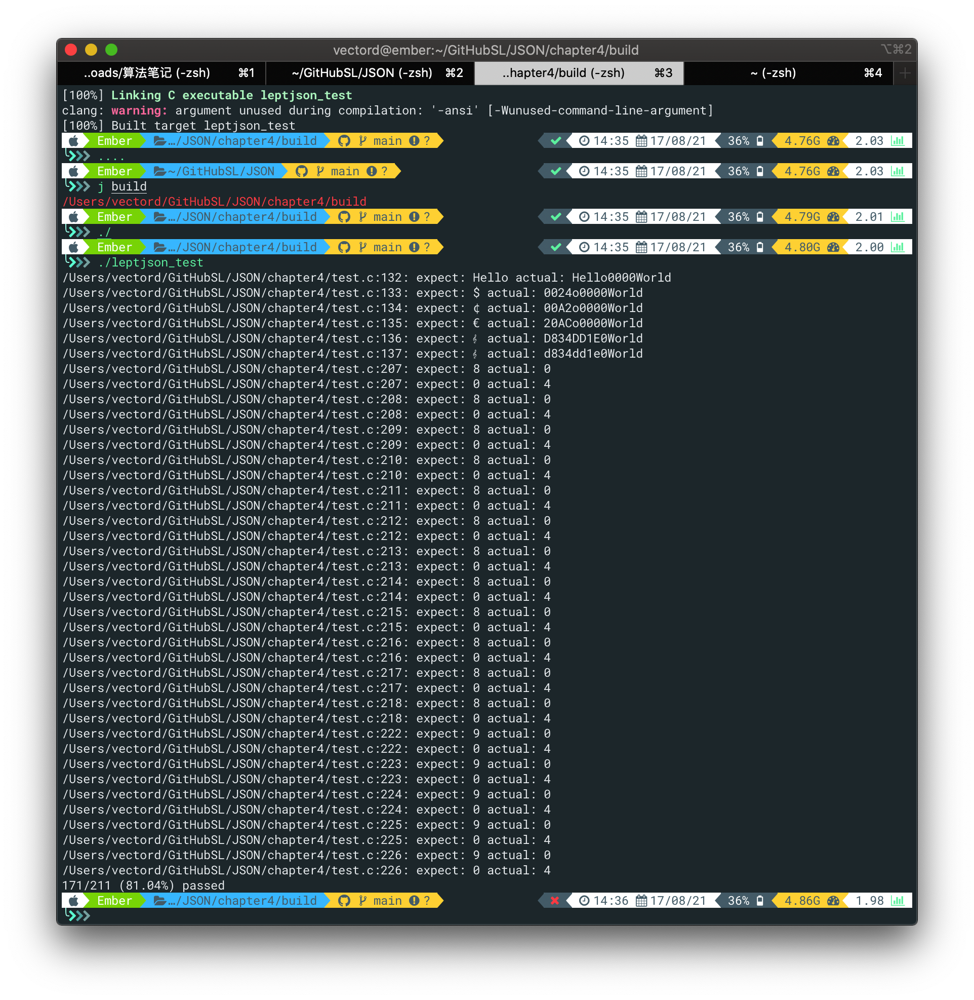
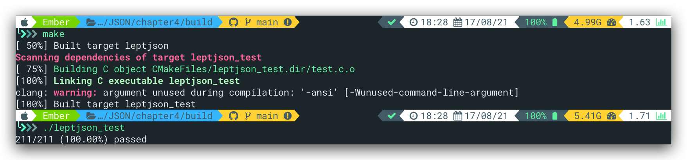

# Unicode与JSON转义序列

## USC

统一字符集（Universal Coded Character Set, UCS），每个字符映射至一个整数码点（code point），码点的范围是 0 至 0x10FFFF，码点又通常记作 U+XXXX，当中 XXXX 为 16 进位数字。

## UTF

UTF为USC码点的存储方式，这些方式称为 Unicode 转换格式（Uniform Transformation Format, UTF）。在lept_json中，使用UTF-8的方式存储。

## 需求

根据以上分析，我们的需求有两点

1. 解析十六进制数为码点
2. 将码点编码为UTF-8

<font color = "red">注意</font>：我们知道，码点的范围是 0 至 0x10FFFF，故单单一个4位16进制无法表示这么大的范围，引入UTF-16中的代理的概念来解决了这个问题。

### BMP

U+0000 至 U+FFFF 这组 Unicode 字符称为基本多文种平面（basic multilingual plane, BMP），还有另外 16 个平面。

### 代理项（Surrogate）

为了解决4位16进制（即2字节）无法表示USC所有字符的问题，引入代理的概念。当需要表示的字符其码点大于`0x10000`时，将其用两个4位16进制表示，即4字节。其中，前两个字节称为高代理项，规定其值位于`0xD800-0xDBFF`范围内，后两个字节为低代理项，规定其范围为`DC00-DFFF`。<font color = "red">这两个范围内的编码无法单独映射字符</font>，每个范围的大小为1024，相乘其大小即为2<sup>20</sup>,即`00000-FFFFF`范围。将该范围映射至`10000-10FFFF`，即2字节码点表示的字符形成连续空间。具体映射公式如下所示，H表示高代理项，L表示低代理项：

```
codepoint = 0x10000 + (H − 0xD800) × 0x400 + (L − 0xDC00)
```

[参考](https://blog.csdn.net/htxhtx123/article/details/104569063)       [UTF-16](https://zhuanlan.zhihu.com/p/147339588)

---

在整理代理项的内容时，产生疑问：既然高代理项和低代理项有特定的范围，那这些范围原来可映射的字符如何表示？查阅[百科](https://baike.baidu.com/item/)统一码/2985798?fromtitle=Unicode&fromid=750500&fr=aladdin得知，Unicode的空间巨大，目前第4-13辅助平面甚至尚未使用！故这两个范围特意表流出来用来表示其他平面。

## UTF-8

之前在C++SL.md中整理过UTF-8的编码格式，这里直接使用那里的内容：

1. 为一种变长的编码方式，使用1～4个字节来表示符号
2. 规则：1）对于单字节的符号，字节的第一位设为0，后面7位为这个符号的 Unicode 码。因此对于英语字母，UTF-8 编码和 ASCII 码是相同的。2）对于n字节的符号（n > 1），第一个字节的前n位都设为1，第n + 1位设为0，后面字节的前两位一律设为10。剩下的没有提及的二进制位，全部为这个符号的 Unicode 码。

可根据如下表格对照起来看：

| 码点范围           | 码点位数 | 字节1    | 字节2    | 字节3    | 字节4    |
| ------------------ | -------- | -------- | -------- | -------- | -------- |
| U+0000 ~ U+007F    | 7        | 0xxxxxxx |          |          |          |
| U+0080 ~ U+07FF    | 11       | 110xxxxx | 10xxxxxx |          |          |
| U+0800 ~ U+FFFF    | 16       | 1110xxxx | 10xxxxxx | 10xxxxxx |          |
| U+10000 ~ U+10FFFF | 21       | 11110xxx | 10xxxxxx | 10xxxxxx | 10xxxxxx |

# Exercise

先来张编写作业代码前的测试结果，还挺刺激的ಠ_ಠ



## Task2

UTF-8的存储。在编写 `lept_encode_utf8()`函数时，脑袋一直绕不过弯来，以`TEST_STRING("\x24", "\"\\u0024\"");`，后面的JSON在解析完成并以UTF-8格式存储之后，应该显示为`\x24`才对。实际上，确实显示了，只不过是以字符的形式显示。换言之，我的疑惑之处在于测试代码解析时只存储数字36至`v->u.s.s`中，没有存储`\u`,`\x`之类的字符，打印出来确实字符而不是`36`。直到我重新回顾了一遍PUTC代码：

```c
#define PUTC(c, ch) do{ *(char*)lept_context_push(c, sizeof(char))=(ch); }while(0)
```

从这行代码能够看出，将36压入栈时，36是作为char类型被压入的；换句话说，压入的是符号`$`的<font color = "red">码点</font>36，而不是字符3和字符6。由于存储的类型为字符（串），故打印时按照字符类型输出，相应的码点输出的便为对应的字符。

将字符转换为UTF-8格式存储的函数`lept_encode_utf8`如下，line12把800写成了8000卡了我好久：

```C
/*将码点解析为UTF-8*/
static void lept_encode_utf8(lept_context* c, unsigned u) {
    /* \TODO */
	if(u<=0x007f){
		PUTC(c, u);
	}
	else if(u>=0x0080&&u<=0x07ff){
		/*>>操作为了分割字节，即分组； &操作为了将高位置0，故第一组全部&0xff，也可以不&*/
		PUTC(c,(0xC0|((u>>6)&0xFF)));/*0xC0 = 1100 0000*/
		PUTC(c,(0x80|((u   )&0x3F)));/*0x80 = 1000 0000, 0x3F将除低六位外全置0*/
	}
	else if(u>=0x0800&&u<=0xFFFF){
		/*printf("%d %d %d\n",0xE0 | ((u >> 12) & 0xFF),0x80 | ((u >>  6) & 0x3F),0x80 | ( u        & 0x3F));
		printf("%d %d %d\n",(0xE0|((u>>12)&0xFF)),(0x80|((u>>6 )&0x3F)),(0x80|((u    )&0x3F)));*/
		PUTC(c,(0xE0|((u>>12)&0xFF)));/*0xE0=1110 0000*/
		PUTC(c,(0x80|((u>>6 )&0x3F)));/*0x80=1000 0000*/
		PUTC(c,(0x80|((u    )&0x3F)));
	}
	else if(u>=0x10000&&u<=0x10FFFF){
		PUTC(c,(0xF0|((u>>18)&0xFF)));/*0xF0=1111 0000*/
		PUTC(c,(0x80|((u>>12)&0x3F)));
		PUTC(c,(0x80|((u>> 6)&0x3F)));
		PUTC(c,(0x80|((u    )&0x3F)));
	}
}
```

## Task 3

Task3总体上没什么太大的波折，按部就班，扫到高代理项则向后扫描是否有低代理项、低代理项是否在范围内，否则就报`LEPT_PARSE_INVALID_UNICODE_SURROGATE`的错，注意扫完高代理项后需要先扫`\\u`。

```C
case 'u':
                        if (!(p = lept_parse_hex4(p, &u)))
                            STRING_ERROR(LEPT_PARSE_INVALID_UNICODE_HEX);
                        /* \TODO surrogate handling */
                        if(ISHIGHSURR(u)){
                            ch = *p++;
                            if(ch!='\\')
                               return LEPT_PARSE_INVALID_UNICODE_SURROGATE;
                            ch = *p++;
                            if(ch!='u')
                               return LEPT_PARSE_INVALID_UNICODE_SURROGATE;
                        	if(!(p=lept_parse_hex4(p, &u2)))
                        		return LEPT_PARSE_INVALID_UNICODE_SURROGATE;
                        	if(ISLOWSURR(u2)){
                        		u = 0x10000+(u-0xD800)*0x400+(u2-0xDC00);
                        	}
                        	else
                        		return LEPT_PARSE_INVALID_UNICODE_SURROGATE;
                        }
                        lept_encode_utf8(c, u);
                        break;
```

以下是叶老师的代码，进位等操作还是很讲究的

```C
case 'u':
			if (!(p = lept_parse_hex4(p, &u)))
          STRING_ERROR(LEPT_PARSE_INVALID_UNICODE_HEX);
      if (u >= 0xD800 && u <= 0xDBFF) { /* surrogate pair */
           if (*p++ != '\\')
              STRING_ERROR(LEPT_PARSE_INVALID_UNICODE_SURROGATE);
           if (*p++ != 'u')
              STRING_ERROR(LEPT_PARSE_INVALID_UNICODE_SURROGATE);
           if (!(p = lept_parse_hex4(p, &u2)))
              STRING_ERROR(LEPT_PARSE_INVALID_UNICODE_HEX);
           if (u2 < 0xDC00 || u2 > 0xDFFF)
              STRING_ERROR(LEPT_PARSE_INVALID_UNICODE_SURROGATE);
           u = (((u - 0xD800) << 10) | (u2 - 0xDC00)) + 0x10000;
       }
       lept_encode_utf8(c, u);
       break;
```



