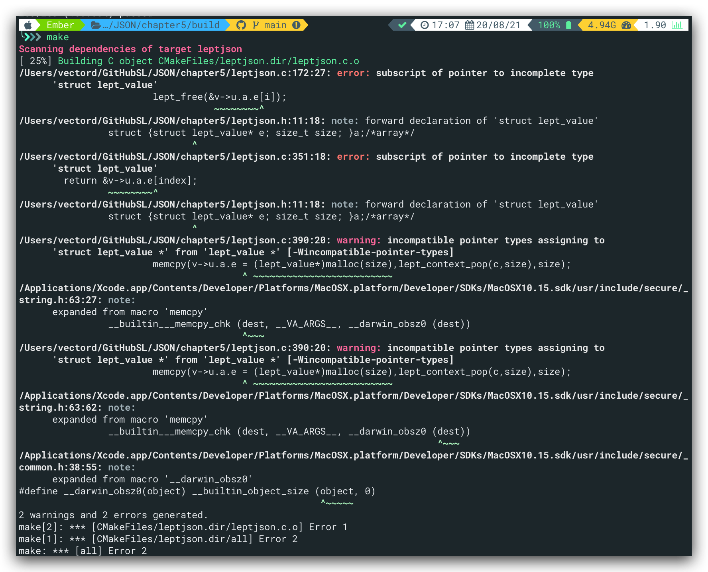

# JSON 数组

与认知中的数组不同，JSON中的数组可以有多种类型，即不像C/C++那样一个数组只能存放一种特定的类型，其语法如下：

```json
array = %x5B ws [ value *( ws %x2C ws value ) ] ws %x5D
```

其中，`%x5B` 是左中括号 `[`，`%x2C` 是逗号 `,`，`%x5D` 是右中括号 `]` ，`ws` 是空白字符。一个数组可以包含零至多个值，以逗号分隔，例如 `[]`、`[1,2,true]`、`[[1,2],[3,4],"abc"]` 都是合法的数组。但注意 JSON 不接受末端额外的逗号，例如 `[1,2,]` 是不合法的（许多编程语言如 C/C++、Javascript、Java、C# 都容许数组初始值包含末端逗号）。

# 存储

这里选择C中的数组来存储JSON数组，原因有如下几点：

1. 能以 `O(1)` 用索引访问任意元素，
2. 次要好处是内存布局紧凑，省内存之余还有高缓存一致性（cache coherence）。

但同时，也有几点缺点：

1. 不能快速插入元素，
2. 在解析 JSON 数组的时候，还不知道应该分配多大的数组才合适。

与之相对的是链表，链表虽然能够快速插入元素，但其查找的开销较大。并且相对于数组，每个节点需要存储下一个节点的指针，造成额外内存开销。同时，链表在内存空间不是连续的，故会令缓存不命中（cache miss）的机会上升。

综上，选择数组存储JSON数组，为此，在`lept_value`中添加以下代码：

```C
typedef struct lept_value lept_value;

struct lept_value {
    union {
        struct { lept_value* e; size_t size; }a; /* array */
        struct { char* s; size_t len; }s;
        double n;
    }u;
    lept_type type;
};
```

<font color = "red">注意：</font>在C中，结构体在定义后，声明一个变量时需要带上`struct`关键字，即`struct name`为一个整体，这点C++与其不同。因此，上面的代码如果没有line1的`typedef`，需要将line5改为`struct lept_value* e;`。

[参考](https://www.cnblogs.com/qiumingcheng/p/11229041.html)

<font color = "red">注意</font>，chapter4_answer中的该结构体的typedef实在定义时同时写的，这里将typedef剥离开来，故结构体定义开头结尾的typedef相关关键字不得出现。

before：

```C
typedef struct{
	union{
		struct {lept_value* e; size_t size; }a;/*array*/
		struct {char* s; size_t len;}s;/*string*/
		double n;                      /*number*/
	}u;
	lept_type type;
} lept_value;
```

after：

```C
typedef struct lept_value lept_value;
/*定义存放json值的结构体，目前只需存放NULL/BOOL值，故只需先存放一个值即可*/
struct lept_value{
	union{
		struct {lept_value* e; size_t size; }a;/*array*/
		struct {char* s; size_t len;}s;/*string*/
		double n;                      /*number*/
	}u;
	lept_type type;
};
```

<span jump id = "jump">is this ok?</span>

解答：以下不行，因为使用的是匿名结构体+typedef，在line3时无法得知`lept_value`的定义来源

```C
typedef struct{
	union{
		struct {struct lept_value* e; size_t size; }a;/*array*/
		struct {char* s; size_t len;}s;/*string*/
		double n;                      /*number*/
	}u;
	lept_type type;
} lept_value;
```

增加两个访问函数：

```C
size_t lept_get_array_size(const lept_value* v);
lept_value* lept_get_array_element(const lept_value* v, size_t index);
```

以及相应的测试：

```C
#if defined(_MSC_VER)
#define EXPECT_EQ_SIZE_T(expect, actual) EXPECT_EQ_BASE((expect) == (actual), (size_t)expect, (size_t)actual, "%Iu")
#else
#define EXPECT_EQ_SIZE_T(expect, actual) EXPECT_EQ_BASE((expect) == (actual), (size_t)expect, (size_t)actual, "%zu")
#endif

static void test_parse_array() {
    lept_value v;

    lept_init(&v);
    EXPECT_EQ_INT(LEPT_PARSE_OK, lept_parse(&v, "[ ]"));
    EXPECT_EQ_INT(LEPT_ARRAY, lept_get_type(&v));
    EXPECT_EQ_SIZE_T(0, lept_get_array_size(&v));
    lept_free(&v);
}
```

关于上面代码的宏，以下一段话直接摘自老师的markdown：

```markdown
在之前的单元中，作者已多次重申，C 语言的数组大小应该使用 size_t 类型。因为我们要验证 lept_get_array_size() 返回值是否正确，所以再为单元测试框架添加一个宏 EXPECT_EQ_SIZE_T。麻烦之处在于，ANSI C（C89）并没有的 size_t 打印方法，在 C99 则加入了 "%zu"，但 VS2015 中才有，之前的 VC 版本使用非标准的 "%Iu"。因此，上面的代码使用条件编译去区分 VC 和其他编译器。虽然这部分不跨平台也不是 ANSI C 标准，但它只在测试程序中，不太影响程序库的跨平台性
```

# 解析

使用同一个堆栈`c->stack`存储数组解析的数据，解析过程有点像计算器实现的逆波兰表达式，即先扫描左标识符(`""`,`[]`等)，将内部元素入栈，扫到右标识符后将栈内元素全部弹出存入value内，再将该value入栈。具体的详细过程可以参考[origin](origin/origin_chapter5.md).

---

## <font color = "red">while(1)和for(;;)的区别</font>

看老师的代码，很多地方都是使用`for(;;)`而不是`while(1)`，不查还真不知道，原来汇编代码上前者执行速度更快。[参考](https://blog.csdn.net/xussy/article/details/91959178)

和for(;;)的区别.png)

# Exercise

## Task1

首先增加了这一行测试：

```C
EXPECT_EQ_INT(LEPT_PARSE_OK,lept_parse(&v,"[ null , false , true , 123 , \"abc\" ]"));
```

然后测试不通过，调试发现是因为`ws parse`的问题，在`while`的<font color = "red">值前后</font>进行解析空格。同样的，Task2的空格解析对应空数组，这里的空格解析对应非空数组。

最终case1的`[ null , false , true , 123 , \"abc\" ]`测试如下：

```C
/*task1 case 1*/
    EXPECT_EQ_INT(LEPT_PARSE_OK,lept_parse(&v,"[ null , false , true , 123 , \"abc\" ]"));
    EXPECT_EQ_INT(LEPT_ARRAY, lept_get_type(&v));
    EXPECT_EQ_SIZE_T(5, lept_get_array_size(&v));
    /*null*/
    EXPECT_EQ_INT(LEPT_NULL, lept_get_type(lept_get_array_element(&v, 0)));
    /*false*/
    EXPECT_EQ_INT(LEPT_FALSE, lept_get_type(lept_get_array_element(&v, 1)));
    /*true*/
    EXPECT_EQ_INT(LEPT_TRUE, lept_get_type(lept_get_array_element(&v, 2)));
    /*number*/
    EXPECT_EQ_INT(LEPT_NUMBER, lept_get_type(lept_get_array_element(&v, 3)));
    EXPECT_EQ_DOUBLE(123.0, lept_get_number(lept_get_array_element(&v, 3)));
    /*string "abd*/
    EXPECT_EQ_INT(LEPT_STRING, lept_get_type(lept_get_array_element(&v, 4)));
    EXPECT_EQ_STRING("abc",lept_get_string(lept_get_array_element(&v, 4)),lept_get_string_length(lept_get_array_element(&v, 4)));
```

case2如下：

```C
lept_init(&v);
    EXPECT_EQ_INT(LEPT_PARSE_OK,lept_parse(&v,"[ [ ] , [ 0 ] , [ 0 , 1 ] , [ 0 , 1 , 2 ] ]"));
    EXPECT_EQ_INT(LEPT_ARRAY, lept_get_type(&v));
    EXPECT_EQ_SIZE_T(4, lept_get_array_size(&v));
    /*[]*/
    EXPECT_EQ_INT(LEPT_ARRAY, lept_get_type(lept_get_array_element(&v, 0)));
    EXPECT_EQ_SIZE_T(0, lept_get_array_size(lept_get_array_element(&v, 0)));
    /*[0]*/
    EXPECT_EQ_INT(LEPT_ARRAY, lept_get_type(lept_get_array_element(&v, 1)));
    EXPECT_EQ_SIZE_T(1, lept_get_array_size(lept_get_array_element(&v, 1)));
    EXPECT_EQ_DOUBLE(0.0, lept_get_number(lept_get_array_element(lept_get_array_element(&v, 1),0)));
    /*[0,1*/
    EXPECT_EQ_INT(LEPT_ARRAY, lept_get_type(lept_get_array_element(&v, 2)));
    EXPECT_EQ_SIZE_T(2, lept_get_array_size(lept_get_array_element(&v, 2)));
    EXPECT_EQ_DOUBLE(0.0, lept_get_number(lept_get_array_element(lept_get_array_element(&v, 2),0)));
    EXPECT_EQ_DOUBLE(1.0, lept_get_number(lept_get_array_element(lept_get_array_element(&v, 2),1)));
    /*[0,1,2]*/
    EXPECT_EQ_INT(LEPT_ARRAY, lept_get_type(lept_get_array_element(&v, 3)));
    EXPECT_EQ_SIZE_T(3, lept_get_array_size(lept_get_array_element(&v, 3)));
    EXPECT_EQ_DOUBLE(0.0, lept_get_number(lept_get_array_element(lept_get_array_element(&v, 3),0)));
    EXPECT_EQ_DOUBLE(1.0, lept_get_number(lept_get_array_element(lept_get_array_element(&v, 3),1)));
    EXPECT_EQ_DOUBLE(2.0, lept_get_number(lept_get_array_element(lept_get_array_element(&v, 3),2)));
```

result：


---

官方：

自己写的与叶老师的task1答案相似，不用之处在于case2叶老师使用for循环，可读性更强

```C
lept_init(&v);
    EXPECT_EQ_INT(LEPT_PARSE_OK, lept_parse(&v, "[ [ ] , [ 0 ] , [ 0 , 1 ] , [ 0 , 1 , 2 ] ]"));
    EXPECT_EQ_INT(LEPT_ARRAY, lept_get_type(&v));
    EXPECT_EQ_SIZE_T(4, lept_get_array_size(&v));
    for (i = 0; i < 4; i++) {
        lept_value* a = lept_get_array_element(&v, i);
        EXPECT_EQ_INT(LEPT_ARRAY, lept_get_type(a));
        EXPECT_EQ_SIZE_T(i, lept_get_array_size(a));
        for (j = 0; j < i; j++) {
            lept_value* e = lept_get_array_element(a, j);
            EXPECT_EQ_INT(LEPT_NUMBER, lept_get_type(e));
            EXPECT_EQ_DOUBLE((double)j, lept_get_number(e));
        }
    }
```

## Task2

在`lept_parse_array`识别`]`前加入whitespace的识别

Task2自己的解答正确，与叶老师的区别在于`,`之后的ws解析移到了循环开始处，而叶老师在`,`分支内解析ws，之后开始下一轮循环，本质上自己与其是一样的。

## Task3

在写Task3时，发现代码中并没有`free`context内栈的相关的代码，其实这是因为在函数`lept_parse`结尾会统一free `lept_context`。

这里由于Mac端的内存泄漏工具`valgrind`不支持Catalina系统了，所以就没装。开始自己在`lept_parse_array`里试着free了一下，产生未malloc而free的问题。

这题最后看的叶老师的解答，应该写在`lept_free()`里。知道位置后自己也尝试着写了，但没通过测试。原因是数组内部的元素仍旧可能是数组，这就要求我们需要递归调用`lept_free()`。

```C
void lept_free(lept_value* v){
	size_t i;
	assert(v!=NULL);
	switch(v->type){
		case LEPT_STRING:
		    free(v->u.s.s);break;
		case LEPT_ARRAY:
		    for(i=0;i<v->u.a.size;i++)
		    	lept_free(&v->u.a.e[i]);
		    free(v->u.a.e);break;
		default:break;
	}
	/*if(v->type==LEPT_STRING){
		free(v->u.s.s);
	}*/
	v->type = LEPT_NULL;/*避免重复释放*/
}
```

## Task4

在`lept_parse_array`开头备份`c->top`，出现错误时先恢复再返回

我的解法只实现了“弹出”，没有实现释放。具体地，对于size内的每一个元素，都需要free过，使用pop获得对应的初始地址即可。

```C
static int lept_parse_array(lept_context* c, lept_value* v) {
    /* ... */
    for (;;) {
        /* ... */
        if ((ret = lept_parse_value(c, &e)) != LEPT_PARSE_OK)
            break;
        /* ... */
        if (*c->json == ',') {
            /* ... */
        }
        else if (*c->json == ']') {
            /* ... */
        }
        else {
            ret = LEPT_PARSE_MISS_COMMA_OR_SQUARE_BRACKET;
            break;
        }
    }
    /* Pop and free values on the stack */
    for (i = 0; i < size; i++)
        lept_free((lept_value*)lept_context_pop(c, sizeof(lept_value)));
    return ret;
}
```

## Task5

~~`lept_context_push`返回的虽然是`void`类型的指针，但其指向的内容还是`lept_context`的类型，~~

这个是啥bug我还是真没看出来。使用改方式修改代码，以上的task测试也全部通过。

看了解答后，知道会出现悬挂指针的问题，而这个问题涉及到需要增加stack的size，即需要压力测试，一般的测试测不出来。以下直接引用叶老师的[answer](origin/tutorial05_answer.md)：

---

这个 bug 源于压栈时，会获得一个指针 `e`，指向从堆栈分配到的空间：

```C
    for (;;) {
        /* bug! */
        lept_value* e = lept_context_push(c, sizeof(lept_value));
        lept_init(e);
        size++;
        if ((ret = lept_parse_value(c, e)) != LEPT_PARSE_OK)
            return ret;
        /* ... */
    }
```

然后，我们把这个指针调用 `lept_parse_value(c, e)`，这里会出现问题，因为 `lept_parse_value()` 及之下的函数都需要调用 `lept_context_push()`，而 `lept_context_push()` 在发现栈满了的时候会用 `realloc()` 扩容。这时候，我们上层的 `e` 就会失效，变成一个悬挂指针（dangling pointer），而且 `lept_parse_value(c, e)` 会通过这个指针写入解析结果，造成非法访问。

---

# TO Do

- [x] [isthisok](#jump)：not OJBK，with error:

  

   this one is ok, add `lept_value` after `struct` 

  ```C
  typedef struct lept_value{
  	union{
  		struct {struct lept_value* e; size_t size; }a;/*array*/
  		struct {char* s; size_t len;}s;/*string*/
  		double n;                      /*number*/
  	}u;
  	lept_type type;
  } lept_value;
  ```

- [x] change `while(1)`  to `for(;;)`

- [x] Task 5消化：

  简单说realloc若重新分配成功可能会返回一个新地址，而这里上层的e指向的是老地址，就变成悬空指针了。[参考](https://blog.csdn.net/snlying/article/details/4005238)

  具体地，会产生形如如下代码的错误：

  ```C
  #include <malloc.h> 
  char *p，*q; 
  p = (char * ) malloc (10); 
  q=p; 
  p = (char * ) realloc (p,20); 
  ```

  即e开始保存了地址，但`lept_parse_value`可能因为realloc重新分配了`c-.stack`的地址，导致e保存的地址已经被回收，e称为悬挂指针

  ```C
      for (;;) {
          /* bug! */
          lept_value* e = lept_context_push(c, sizeof(lept_value));
          lept_init(e);
          size++;
          if ((ret = lept_parse_value(c, e)) != LEPT_PARSE_OK)
              return ret;
          /* ... */
      }
  
  ```

  

