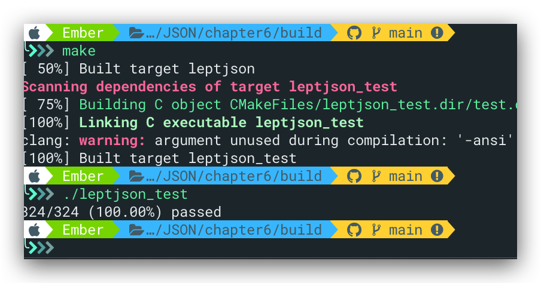

本节为解析器部分的最后一个内容，即JSON对象的解析

# JSON对象

与数组类似，不同的是对象使用花括号`{}` (`U+007B` `U+007D`) 进行解析，并且由对象成员`member`组成。对象成员为键值对，其中键为JSON字符串，值为JSON值。（数组内部的成员即为JSON值）。完整语法：

```Markdown
member = string ws %x3A ws value
object = %x7B ws [ member *( ws %x2C ws member ) ] ws %x7D
```

对应符号：

| 码点 | 符号 |
| :--: | :--: |
| 007B |  {   |
| 007D |  }   |
| 002C |  ,   |
| 003A |  :   |

使用动态数组的结构来存储对象，动态功能将在第八节加入，具体的数据结构实现如下：

```C
typedef struct lept_value lept_value;
typedef struct lept_member lept_member;

struct lept_value {
    union {
        struct { lept_member* m; size_t size; }o;
        struct { lept_value* e; size_t size; }a;
        struct { char* s; size_t len; }s;
        double n;
    }u;
    lept_type type;
};

struct lept_member {
    char* k; size_t klen;   /* member key string, key string length */
    lept_value v;           /* member value */
};
```

即存储对象的结构为`lept_value`+字符串

对应的访问函数；

```C
size_t lept_get_object_size(const lept_value* v);
const char* lept_get_object_key(const lept_value* v, size_t index);
size_t lept_get_object_key_length(const lept_value* v, size_t index);
lept_value* lept_get_object_value(const lept_value* v, size_t index);
```

# String_Parse重构

由于JSON的键值也是一个字符串，而我们使用`lept_value`存储的话会造成`type`字段的浪费，而`lept_parse_string()` 是直接地把解析的结果写进一个 `lept_value`，故我们需要将`lept_parse_string()` 拆分重构，具体的代码如下：（Task1）

```C
/*refactoring of string parse*/
/* 解析 JSON 字符串，把结果写入 str 和 len */
/* str 指向 c->stack 中的元素，需要在 c->stack  */
static int lept_parse_string_raw(lept_context* c, char** str, size_t* len) {
    size_t head = c->top;
    unsigned u, u2;
	const char* p;
	EXPECT(c,'\"');
	p = c->json;
	for(;;){
		char ch = *p++;
		switch(ch){
			case '\"':
			    *len = c->top - head;
			    /*lept_set_string(v, (const char*)lept_context_pop(c, len),len);*/
			    *str = (char*)lept_context_pop(c, *len);
			    c->json = p;
			    return LEPT_PARSE_OK;
			case '\0':
			    STRING_ERROR(LEPT_PARSE_MISS_QUOTATION_MARK);
			case '\\':
			    ch = *p++;
			    switch(ch){
			    	case '\"': PUTC(c,'\"');break;
			    	case '\\': PUTC(c,'\\');break;
			    	case '/':  PUTC(c,'/'); break;
			    	case 'b':  PUTC(c,'\b');break;
			    	case 'f':  PUTC(c,'\f');break;
			    	case 'n':  PUTC(c,'\n');break;
			    	case 'r':  PUTC(c,'\r');break;
			    	case 't':  PUTC(c,'\t');break;
			    	case 'u':
                        if (!(p = lept_parse_hex4(p, &u)))
                            STRING_ERROR(LEPT_PARSE_INVALID_UNICODE_HEX);
                        /* \TODO surrogate handling */
                        if(ISHIGHSURR(u)){
                            ch = *p++;
                            if(ch!='\\')
                               return LEPT_PARSE_INVALID_UNICODE_SURROGATE;
                            ch = *p++;
                            if(ch!='u')
                               return LEPT_PARSE_INVALID_UNICODE_SURROGATE;
                        	if(!(p=lept_parse_hex4(p, &u2)))
                        		return LEPT_PARSE_INVALID_UNICODE_SURROGATE;
                        	if(ISLOWSURR(u2)){
                        		u = 0x10000+(u-0xD800)*0x400+(u2-0xDC00);
                        	}
                        	else
                        		return LEPT_PARSE_INVALID_UNICODE_SURROGATE;
                        }
                        lept_encode_utf8(c, u);
                        break;
			    	default:
			    	STRING_ERROR(LEPT_PARSE_INVALID_STRING_ESCAPE);
			    }
			    break;
			default:
			    if((unsigned)ch<0x20){
			    	STRING_ERROR(LEPT_PARSE_INVALID_STRING_CHAR);
			    }
			    PUTC(c,ch);/*每个字符入栈*/
		}
	}
}

static int lept_parse_string(lept_context* c, lept_value* v){
	size_t len;
	char* s;
	int ret = -1;
	if((ret=lept_parse_string_raw(c,&s,&len))==LEPT_PARSE_OK)
		lept_set_string(v,s,len);
	return ret;
}
```

重构前后均通过测试

# 对象解析&Task2

自己第一遍写的：

```C
static int lept_parse_object(lept_context* c, lept_value* v){
	size_t size;
	lept_member m;
	int ret;
	EXPECT(c, '{');
	lept_parse_whitespace(c);
	/*空对象*/
	if(*c->json == '}'){
		c->json++;
		v->type = LEPT_OBJECT;
		v->u.o.m = NULL;
		v->u.o.size = 0;
		return LEPT_PARSE_OK;
	}
	m.k = NULL;
	size = 0;
	for(;;){
		lept_init(&m.v);
		/*parse key to m.k, m.klen*/
		if((ret=lept_parse_string_raw(c,&m.k,&m.klen))!=LEPT_PARSE_OK)
			break;
		/*parse ws colon ws*/
		lept_parse_whitespace(c);
		if(*c->json!=':'){
			ret = LEPT_PARSE_MISS_COLON;
			break;
		}
		lept_parse_whitespace(c);
    c->json++;
		/*parse value*/
		if((ret=lept_parse_value(c,&m.v))!=LEPT_PARSE_OK){
			break;
		}
		memcpy(lept_context_push(c,sizeof(lept_member)),&m,sizeof(lept_member));
		size++;
		m.k = NULL;/* ownership is transferred to member on stack */
		/*parse ws [comma|right-curly-brace] ws*/
		lept_parse_whitespace(c);
		if(*c->json==',')
			c->json++;
		else if(*c->json=='}'){
			c->json++;
			v->type = LEPT_OBJECT;
			v->u.o.size = size;
			size*=sizeof(lept_member);
			memcpy(v->u.o.m=(lept_member*)malloc(size),lept_context_pop(c,size),size);
			return LEPT_PARSE_OK;
		}
		else{
			ret = LEPT_PARSE_MISS_COMMA_OR_CURLY_BRACKET;
			break;
		}
	}
	/*pop and free members on the stacks*/
	return ret;
}
```

1. line28、29的顺序错误，应该是向后移动指针再解析ws
2. line20直接将`m.k` `m.klen`传入错误，因为`m.k`传入的话将直接指向`c->stack`，使得line34 copy时出现错误，即m中的内容copy至`c->stack`后被错位覆盖
3. 使用临时变量`char *s = NULL;size_t len = 0;`，注意len不得定义为指针类型，否则需要malloc，较为麻烦。之后需要使用`memcpy`将s中的内容复制到`m.k`中，注意这里<font color = "red">需要malloc</font>

---

8月22

4. 解析了`,`之后紧跟着需要解析ws

更正了以上四点后，通过object基础测试，代码如下：

```C
static int lept_parse_object(lept_context* c, lept_value* v){
	size_t size;
	lept_member m;
	int ret;
    char *s = NULL;
    size_t len = 0;
	EXPECT(c, '{');
	lept_parse_whitespace(c);
	/*空对象*/
	if(*c->json == '}'){
		c->json++;
		v->type = LEPT_OBJECT;
		v->u.o.m = NULL;
		v->u.o.size = 0;
		return LEPT_PARSE_OK;
	}
	m.k = NULL;
	size = 0;
	for(;;){
		lept_init(&m.v);
		/*parse key to m.k, m.klen*/
		if((ret=lept_parse_string_raw(c,&s,&len))!=LEPT_PARSE_OK)
			break;
        m.klen = len;
        memcpy(m.k = (char*)malloc(m.klen), s, m.klen);
		/*parse ws colon ws*/
		lept_parse_whitespace(c);
		if(*c->json!=':'){
			ret = LEPT_PARSE_MISS_COLON;
			break;
		}
        c->json++;
		lept_parse_whitespace(c);
		/*parse value*/
		if((ret=lept_parse_value(c,&m.v))!=LEPT_PARSE_OK){
			break;
		}
		memcpy(lept_context_push(c,sizeof(lept_member)),&m,sizeof(lept_member));
		size++;
		m.k = NULL;/* ownership is transferred to member on stack */
		/*parse ws [comma|right-curly-brace] ws*/
		lept_parse_whitespace(c);
		if(*c->json==','){
			c->json++;
			lept_parse_whitespace(c);
		}
		else if(*c->json=='}'){
			c->json++;
			v->type = LEPT_OBJECT;
			v->u.o.size = size;
			size*=sizeof(lept_member);
			memcpy(v->u.o.m=(lept_member*)malloc(size),lept_context_pop(c,size),size);
			return LEPT_PARSE_OK;
		}
		else{
			ret = LEPT_PARSE_MISS_COMMA_OR_CURLY_BRACKET;
			break;
		}
	}
	/*pop and free members on the stacks*/
	return ret;
}
```


## test_parse_miss_key

未加入`LEPT_PARSE_MISS_KEY`的判定，在`lept_parse_string_raw`前加入如下代码：

```C
if(*c->json!='\"'){
			ret = LEPT_PARSE_MISS_KEY;
			break;
		}
```

加入以上代码后，如下测试无法通过：

```C
TEST_ERROR(LEPT_PARSE_MISS_KEY, "{\"a\":1,");
```

即在出现错误时返回前没有将c->stack清空，导致`lept_parse`内部断言`assert(c->top==0)`失败

添加如下代码：

```C
for(i=0;i<size;i++){
		lept_free((lept_value*)lept_context_pop(c,sizeof(lept_member)));
	}
```

最终，所有测试全部通过，最终的task2代码如下：

```C
static int lept_parse_object(lept_context* c, lept_value* v){
	size_t size, i;
	lept_member m;
	int ret;
    char *s = NULL;
    size_t len = 0;
	EXPECT(c, '{');
	lept_parse_whitespace(c);
	/*空对象*/
	if(*c->json == '}'){
		c->json++;
		v->type = LEPT_OBJECT;
		v->u.o.m = NULL;
		v->u.o.size = 0;
		return LEPT_PARSE_OK;
	}
	m.k = NULL;
	size = 0;
	for(;;){
		lept_init(&m.v);
		/*parse key to m.k, m.klen*/
		if(*c->json!='\"'){
			ret = LEPT_PARSE_MISS_KEY;
			break;
		}
		if((ret=lept_parse_string_raw(c,&s,&len))!=LEPT_PARSE_OK)
			break;
        m.klen = len;
        memcpy(m.k = (char*)malloc(m.klen), s, m.klen);
		/*parse ws colon ws*/
		lept_parse_whitespace(c);
		if(*c->json!=':'){
			ret = LEPT_PARSE_MISS_COLON;
			break;
		}
        c->json++;
		lept_parse_whitespace(c);
		/*parse value*/
		if((ret=lept_parse_value(c,&m.v))!=LEPT_PARSE_OK){
			break;
		}
		memcpy(lept_context_push(c,sizeof(lept_member)),&m,sizeof(lept_member));
		size++;
		m.k = NULL;/* ownership is transferred to member on stack */
    //free(m.k);
		/*parse ws [comma|right-curly-brace] ws*/
		lept_parse_whitespace(c);
		if(*c->json==','){
			c->json++;
			lept_parse_whitespace(c);
		}
		else if(*c->json=='}'){
			c->json++;
			v->type = LEPT_OBJECT;
			v->u.o.size = size;
			size*=sizeof(lept_member);
			memcpy(v->u.o.m=(lept_member*)malloc(size),lept_context_pop(c,size),size);
			return LEPT_PARSE_OK;
		}
		else{
			ret = LEPT_PARSE_MISS_COMMA_OR_CURLY_BRACKET;
			break;
		}
	}
	/*pop and free members on the stacks*/
	for(i=0;i<size;i++){
		lept_free((lept_value*)lept_context_pop(c,sizeof(lept_member)));
	}
	return ret;
}
```


~~注意`free(m.k)`~~

# 总结

回过头来，看一下这两个函数；

```C
static void* lept_context_push(lept_context* c, size_t size){
	void* ret;
	assert(size>0);
	if(c->top+size>c->size){
		if(c->size==0){
			c->size = LEPT_PARSE_STACK_INIT_SIZE;
		}
		while(c->top+size>c->size){
			c->size+=c->size>>1;
		}
		c->stack = (char*)realloc(c->stack,c->size);
	}
	ret = c->stack+c->top;
	c->top+=size;
	return ret;
}

static void* lept_context_pop(lept_context* c, size_t size){
	assert(c->top>=size);
	return c->stack+(c->top-=size);
}
```

这两个函数，有两个特点：

1. 返回值类型为void指针：在chapter3写字符串解析时还有点疑惑为什么不直接写成`char*`类型，实现了数组与对象解析后才了解到指定为void类型的指针能够复用`c->stack`栈而不用重新设立数据结构，妙。至于类型转换的问题，size传入正确时，使用memcpy即可。

2. 这两个函数并没有实现真正的压入和弹出操作，只是返回相应的首地址（以及扩容）；压栈和弹出的操作外部调用完成（`PUTC`  `memcpy`)；这样的好处叶老师在[chapter5_answer](../chapter5/origin/tutorial05_answer.md)最后提到过，

   > 这样的 API 设计在一些情况会更方便一些，例如在把字符串值转化（stringify）为 JSON 时，我们可以预先在堆栈分配字符串所需的最大空间，而当时是未有数据填充进去的。

   具体的实现应该在后两章中能够看到

# Answer Checking

## Task1

task1与叶老师的答案完全一样

## Task2

如果不考虑Task3的内存free部分，该部分答案也基本一致

## Task3

本来打算上午花一点时间核对一下答案然后今天（8.22）继续推进chapter7的，结果Task3花了一下午，最终也没有想出个所以然来。主要问题在于`m.k`的free位置：

1. 叶老师对于`m.k`的free放在了循环体的外面，但事实上每次循环`m.k`都会`malloc`新的内存。这个地方卡了我很久，直到看了[这个issue](https://github.com/miloyip/json-tutorial/issues/174)。刚看完这个issue的时候一直在想，`memcpy`的功能是拷贝，source指针的内存所有权并没有被转移，知道又看一遍代码，这一句:

   `memcpy(lept_context_push(c,sizeof(lept_member)),&m,sizeof(lept_member));`

   是把m的值拷贝进c的栈里，这里暂时还看不出什么端倪；又回过头去看了一下`member`的结构，才猛然间回想起，`m.k`是一个指针，意思就是上面的那行代码把指针的值，即地址值拷贝进了c的栈里、`m.k` malloc的地址值拷贝进了栈里，其释放会由最后的for循环统一负责。

   但还是有一个问题，我在代码里增加`free(m.k)`以后，Xcode里单步调试与直接运行的结果会不一样，to-do

2. for循环break后，我原来的代码是这样的：

   ```C
   lept_free((lept_value*)lept_context_pop(c,sizeof(lept_member)));
   ```

   这样其实只是将`c->stack`的栈顶置0，并没有free内部的内存。（因为`lept_context_pop`函数仅仅返回出栈的首地址指针，并不执行弹出操作）正确做法应该是每次取出栈顶的member，free其内部的k以及value

   <font color = "red">还有一点，</font>break时临时的member没有将k地址copy至内存，故也需要free

   ```C
   	free(m.k);
   	for(i=0;i<size;i++){
   		// lept_free((lept_value*)lept_context_pop(c,sizeof(lept_member)));
   		lept_member* m = (lept_member*)lept_context_pop(c, sizeof(lept_member));
           free(m->k);
           lept_free(&m->v);
   	}
   ```

   个人认为叶老师的answer中最后的`v->type = LEPT_NULL;`没必要，因为break显然不会改变初始type`LEPT_NULL`。

3. `lept_free`应该增加`object`类型的free，今天一直在死磕第一点，把这一点给疏忽了🤦‍♂️

   ```C
   void lept_free(lept_value* v) {
       size_t i;
       assert(v != NULL);
       switch (v->type) {
           /* ... */
           case LEPT_OBJECT:
               for (i = 0; i < v->u.o.size; i++) {
                   free(v->u.o.m[i].k);
                   lept_free(&v->u.o.m[i].v);
               }
               free(v->u.o.m);
               break;
           default: break;
       }
       v->type = LEPT_NULL;
   }
   ```

Finally：



# To do

- [x] Task2的第三点直接传入`m.klen`是否也可：可以

- [ ] 代码：

  ```C
  static int lept_parse_object(lept_context* c, lept_value* v){
  	size_t size, i;
  	lept_member m;
  	int ret;
      char *s = NULL;
      /*size_t len = 0;*/
  	EXPECT(c, '{');
  	lept_parse_whitespace(c);
  	/*空对象*/
  	if(*c->json == '}'){
  		c->json++;
  		v->type = LEPT_OBJECT;
  		v->u.o.m = NULL;
  		v->u.o.size = 0;
  		return LEPT_PARSE_OK;
  	}
  	m.k = NULL;
  	size = 0;
  	for(;;){
  		lept_init(&m.v);
  		/*parse key to m.k, m.klen*/
  		if(*c->json!='\"'){
  			ret = LEPT_PARSE_MISS_KEY;
  			break;
  		}
  		if((ret=lept_parse_string_raw(c,&s,&m.klen))!=LEPT_PARSE_OK)
  			break;
          /*m.klen = len;*/
          memcpy(m.k = (char*)malloc(m.klen), s, m.klen);
  		/*parse ws colon ws*/
  		lept_parse_whitespace(c);
  		if(*c->json!=':'){
  			ret = LEPT_PARSE_MISS_COLON;
  			break;
  		}
          c->json++;
  		lept_parse_whitespace(c);
  		/*parse value*/
  		if((ret=lept_parse_value(c,&m.v))!=LEPT_PARSE_OK){
  			break;
  		}
  		memcpy(lept_context_push(c,sizeof(lept_member)),&m,sizeof(lept_member));
  		size++;
  		free(m.k);
  		m.k = NULL;/* ownership is transferred to member on stack */
  		/*parse ws [comma|right-curly-brace] ws*/
  		lept_parse_whitespace(c);
  		if(*c->json==','){
  			c->json++;
  			lept_parse_whitespace(c);
  		}
  		else if(*c->json=='}'){
  			c->json++;
  			v->type = LEPT_OBJECT;
  			v->u.o.size = size;
  			size*=sizeof(lept_member);
  			memcpy(v->u.o.m=(lept_member*)malloc(size),lept_context_pop(c,size),size);
  			return LEPT_PARSE_OK;
  		}
  		else{
  			ret = LEPT_PARSE_MISS_COMMA_OR_CURLY_BRACKET;
  			break;
  		}
  	}
  	/*pop and free members on the stacks*/
  	for(i=0;i<size;i++){
  		// lept_free((lept_value*)lept_context_pop(c,sizeof(lept_member)));
  		lept_member* m = (lept_member*)lept_context_pop(c, sizeof(lept_member));
          free(m->k);
          lept_free(&m->v);
  	}
  	return ret;
  }
  ```

  运行与调试的结果不同，出错原因应该在line44

  