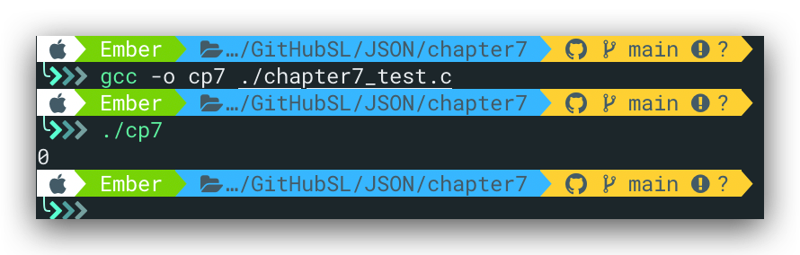

# JSON解析器

前六章节实现的是JSON解析器，将JSON文本解析为`lept_value`的树形结构。而生成器的作用则相反，将树形结构转换为JSON文本。该过程又称为**字符串化(stringify)**，其API如下所示：

```c
char* lept_stringify(const lept_value* v, size_t* length);
```

其中，`length`参数可选，传入`NULL`时忽略该参数，调用方负责内存的`free()`

为简单起见，不做换行、缩进等处理，生成单行的、无空白字符的最紧凑形式。

# 动态数组

在解析过程中，我们使用`lept_context`的栈`c->stack`存储临时的解析结果，在生产JSON数据时，我们也可以使用该结构存储生成的临时结果。

```C
#ifndef LEPT_PARSE_STRINGIFY_INIT_SIZE
#define LEPT_PARSE_STRINGIFY_INIT_SIZE 256
#endif

int lept_stringify(const lept_value* v, char** json, size_t* length) {
    lept_context c;
    int ret;
    assert(v != NULL);
    assert(json != NULL);
    c.stack = (char*)malloc(c.size = LEPT_PARSE_STRINGIFY_INIT_SIZE);
    c.top = 0;
    if ((ret = lept_stringify_value(&c, v)) != LEPT_STRINGIFY_OK) {
        free(c.stack);
        *json = NULL;
        return ret;
    }
    if (length)
        *length = c.top;
    PUTC(&c, '\0');
    *json = c.stack;
    return LEPT_STRINGIFY_OK;
}
```

这里length的作用是在传入非空值时获取生成的JSON的长度，那么，为什么不用`strlen`呢？诚然，使用`strlen`可以获得JSON长度，因我我们生成的JSON不含空字符。但会带来不必要的性能损耗。

---

关于指针的指针：

上面的代码中有一次出现了`char **`的类型，这与chapter6的`lept_parse_string_raw(lept_context* c, char** str, size_t* len)`函数一样，都是指针的指针。下面以该函数为例，再来回顾一下相关的知识点。

```C
/* str 指向 c->stack 中的元素*/
static int lept_parse_string_raw(lept_context* c, char** str, size_t* len) {
    size_t head = c->top;
    unsigned u, u2;
	const char* p;
	EXPECT(c,'\"');
	p = c->json;
	for(;;){
		char ch = *p++;
		switch(ch){
			case '\"':
			    *len = c->top - head;
			    /*lept_set_string(v, (const char*)lept_context_pop(c, len),len);*/
			    *str = (char*)lept_context_pop(c, *len);
			    c->json = p;
			    return LEPT_PARSE_OK;
			/**/
		}
	}
```

我们知道，str指向的是`c->stack`，而`c->stack`为`char*`类型，故str需要定义为`char*`类型的指针，这很好理解。那么，关键问题在于，我们将str仅仅定义为`char*`类型可不可以？

面对指针一类的问题，自己的通常思考方式是将其视为一个整体（事实上本来就是一个整体，只是潜意识里老是将*与前面的type分开），然后忽略其类型。这样一来，`str`和`c->stack`属于同一种类型，我们不妨记该类型为`type`。则，相当于函数变为`lept_parse_string_raw(lept_context* c, type str, size_t* len)`，我们在该函数内部使用`type c->stack`来改变`str`的值。显然，由于C的传值特性，传入的参数str其值无法被改变。一个最简单的例子如下：

```C
#include <stdio.h>

void changenum(int a){
	a = 1;
	return;
}

int main(){
	int a = 0;
	changenum(a);
	printf("%d\n",a);
	return 0;
}
```

结果：



因此，需要使用`type*`类型的str来指向`c->stack`，即`char**`。